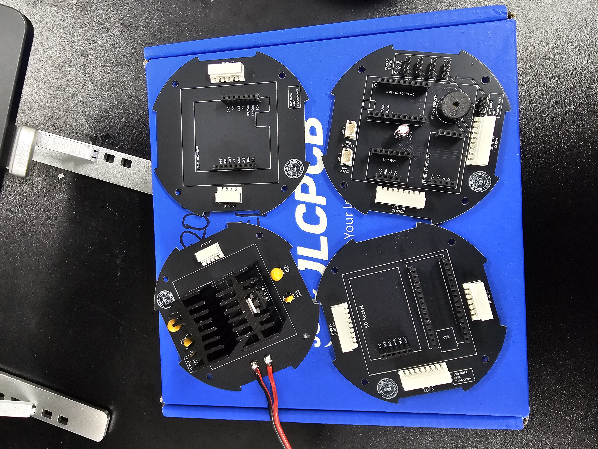
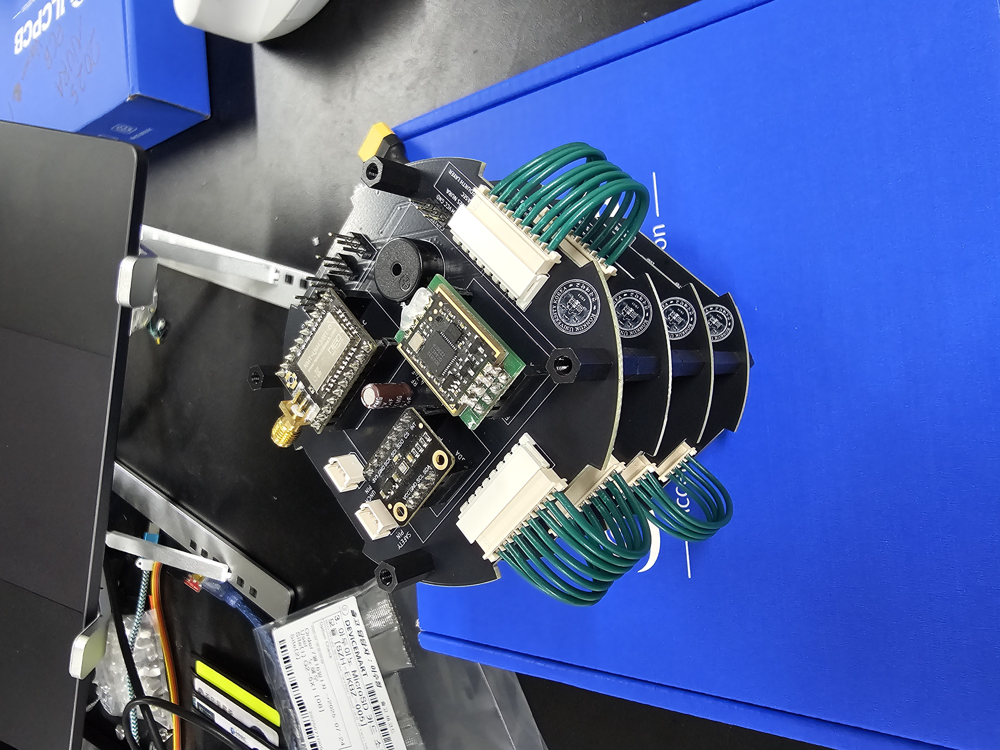
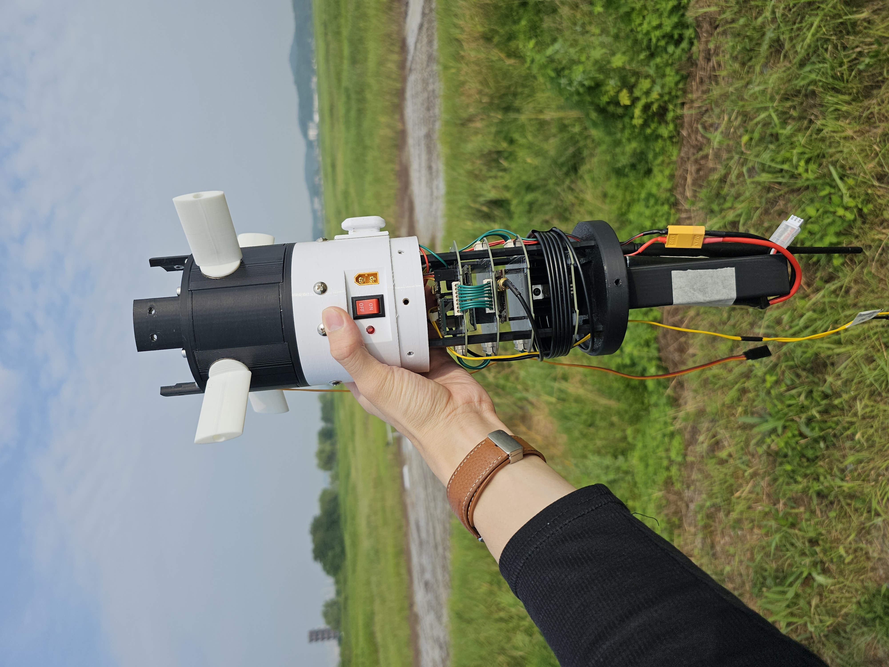

# 🚀 2025 NURA Avionics - TEAM ASEC


## Introduction

<div align="center">


</div>

본 Repository는 **건국대학교 항공우주동아리 ASEC 로켓팀**이 2025년도 NURA 대회를 위해 개발한 Avionics 코드입니다.  

이번 대회의 목표는 **카나드를 통한 롤 제어**이며, 발사 후 로켓을 **90° 롤 회전 후 안정적으로 유지**함으로써 제어 성능을 입증하고자 합니다.

### System Goals
- 기본적인 로켓 발사 및 회수 기능 수행  
- 건국대학교 연구 목표 충족 및 검증

### Key Requirements
1. 전원 인가 후 최소 **30분 이상 안정 동작**  
2. 지상 준비 과정에서는 안전핀(Safety Pin)으로 낙하산 사출 방지  
3. 센서 데이터의 SD 카드 저장 & 지상국 실시간 전송
4. 실시간 자세 추정 데이터를 기반으로 롤 축 제어 수행  
5. 지정된 조건 충족 시 낙하산 반드시 사출  
6. 지상국과 최소 400m 이상 통신 거리 확보

### Features

* **실시간 롤 제어**: IMU 센서의 Yaw 데이터를 입력받아, PD 제어 알고리즘을 통해 4개의 카나드를 움직여 로켓의 롤 회전을 억제합니다.
* **FreeRTOS 기반 멀티태스킹**: 제어, 센싱, 데이터 로깅, 통신 등 우선순위가 다른 다중 작업을 실시간 운영체제를 통해 안정적으로 동시에 처리합니다.
* **다중 센서 처리**: IMU, 기압계, GPS 센서를 통합하여 비행 상태를 포괄적으로 추적하며, 체크섬이 포함된 바이너리 프로토콜을 사용하여 데이터의 신뢰성을 확보합니다.
* **다중 조건 사출 시스템**: 고도 강하, 자세 불안정, 시간 초과의 조건을 만족 시 낙하산 사출을 보장합니다.
* **안정적인 데이터 관리**: 모든 비행 데이터를 온보드 SD 카드에 CSV 파일로 저장하는 동시에, 447MHz RF 통신을 통해 지상국으로 실시간 원격 전송합니다.
* **효율적인 통신 프로토콜**: `float` 데이터를 압축/스케일링하여 전송 데이터 크기를 최소화한 바이너리 패킷을 사용하여, 한정된 통신 환경에서의 데이터 전송 효율을 극대화합니다.  

## Hardware Configuration

### Bill of Materials (BOM)

<div align="center">

| Main Category         | Sub Category         | Component / Model                  |
|-----------------------|----------------------|------------------------------------|
| **MCU & Core**        | MCU                  | Arduino Nano ESP32                 |
| **Sensors**           | IMU                  | EBIMU-9DOFV5-R3                    |
|                       | Barometric           | DFRobot Fermion BMP390L            |
|                       | GPS Module           | SparkFun GPS Breakout - NEO-M9N, SMA |
|                       | GPS Antenna          | AKA150                             |
| **RF & Communication**| RF Module            | NMT-UM434R1-C SEVB (G2)            |
|                       | RF Antenna           | NMT-SA434G2                        |
|                       | GCS Antenna          | YG-447                             |
| **Storage & Power**   | SD Socket            | SZH-EKBZ-005                       |
|                       | 3.3V LDO             | LM1117T-3.3/NOPB                   |
|                       | 5V LDO               | L4940V5                            |
| **Actuators**         | Canard Servo         | AFRC-D3519HB-S                     |
|                       | Parachute Servo      | S2300M                             |

</div>

### PCB Design

<div align="center">

  
  
  

</div>

본 PCB는 **KiCad 9.0**을 이용하여 설계되었습니다. 공간 효율성을 극대화하기 위해 보드를 **4개의 파트로 분할 설계**하고, 이를 **적층(Stacked) 구조**로 구성하였습니다.  

각 PCB 층은 몰렉스 커넥터를 통해 연결되며, 핀이 90° 꺾인 **몰렉스 5268**을 PCB에 납땜하고, **몰렉스 5264**를 이용하여 상호 연결하도록 구현하였습니다.  

📂 PCB 설계 파일은 아래 링크에서 확인하실 수 있습니다:  
[Google Drive - PCB Files](https://drive.google.com/file/d/1G7LwpJqrYb3B2x5KDOTYG1Fmn34BIEfY/view?usp=drive_link)  


## Code Description

### 1. Code Structure

```
.
├── 2025nura.ino         # 메인 애플리케이션 및 RTOS 태스크 정의  
├── EBIMU_AHRS.h/.cpp    # IMU 드라이버  
├── BMP390L.h/.cpp       # 기압계 드라이버 (Wrapper)  
├── bmp3.h/.c            # 기압계 드라이버 (Low-Level)  
├── bmp3_defs.h          # 기압계 드라이버 (Definitions)  
├── ubx_gps.h/.cpp       # GPS 드라이버  
├── ubx_config.h         # GPS 설정  
├── ejection.h/.cpp      # 사출 로직 클래스  
├── SDLogger.h/.cpp      # SD카드 로거 클래스  
├── packet_2025.h/.cpp   # RF 통신 패킷 클래스  
├── NMT.h/.cpp           # RF 통신 모듈 클래스  
└── baro_I2C.h/.cpp      # I2C 통신 헬퍼 클래스  
```
### 2. Software Architecture

본 시스템은 **FreeRTOS**를 기반으로 한 **멀티태스킹** 및 **모듈형 객체 지향 설계**를 채택하여 안정성과 확장성을 확보했습니다.

* **실시간 멀티태스킹**: 제어, 센싱, 데이터 처리 등 각기 다른 주파수와 우선순위를 갖는 기능들을 독립적인 **Task**로 분리하여 실시간 성능을 보장합니다.
    * `FlightControl`: **(우선순위 3)** 100Hz+ 주기로 동작하는 최고 우선순위의 롤 제어 태스크
    * `ATTALT`: **(우선순위 2)** 100Hz 주기로 IMU와 기압계 데이터를 수집하는 센서 태스크
    * `Parachute`: **(우선순위 2)** 수신된 데이터를 바탕으로 사출 조건을 판단하는 태스크
    * `SRG`: **(우선순위 1)** 20Hz 주기로 SD카드 기록, RF 전송, GPS 수신을 담당하는 데이터 관리 태스크
* **모듈형 설계**: 모든 하드웨어와 로직은 명확한 단일 책임을 갖는 **C++ 클래스**로 추상화되어 있습니다. 이로 인해 코드의 재사용성과 테스트 용이성이 향상됩니다.
* **데이터 흐름**: 태스크 간 데이터 교환은 FreeRTOS의 **Queue**를 통해 **스레드-세이프Thread-Safe**하게 이루어지며, 이는 데이터의 충돌이나 유실을 방지합니다.

### 3. Core Components

**2025nura.ino**
* 모든 하드웨어 드라이버와 로직 클래스의 객체를 생성하고 초기화합니다.
* FreeRTOS 태스크를 정의하고 스케줄러를 시작하여 시스템의 전체 동작을 총괄합니다.

**센서 데이터 처리**
* **`EBIMU_AHRS` (IMU)**: UART를 통해 실시간 자세 추정 데이터를 읽어옵니다. Checksum으로 데이터 무결성을 검증하는 안정적인 바이너리 프로토콜을 파싱하여 정확한 자세 및 모션 데이터를 제공합니다.
* **`BMP390L` (Barometric)**: I2C 통신을 통해 온도와 기압 데이터를 읽고, 정확한 고도로 변환합니다.
* **`UbxGPS` (GPS)**: u-blox GPS 모듈과 I2C 통신을 통해 GPS 데이터를 받아옵니다. 불필요한 NMEA 메시지를 끄고, **UBX-NAV-PVT** 프로토콜 parse하여 위치/속도 데이터를 수신합니다.

**낙하산 사출 및 서보 제어**
* **`ejection`**: 낙하산 사출 로직을 전담하는 클래스입니다. **고도 강하, 자세 불안정, 시간 초과**의 조건 중 하나라도 만족하면 낙하산을 사출합니다.
* **`FlightControl`**: PD 제어 알고리즘을 구현하여 IMU로부터 받은 Yaw 각도 오차를 바탕으로 카나드의 각도를 조절, 로켓의 롤 회전을 제어합니다.

**데이터 저장 및 통신**
* **`SDFatLogger`**: `SdFat` 라이브러리를 사용하여 모든 비행 데이터를 CSV 파일로 기록합니다. 비행마다 새 파일을 자동 생성하고, `flush()`를 통해 데이터 손실을 방지합니다.
* **`Packet` (데이터 패킷 생성기)**: 전송 효율을 위해 `float` 데이터를 `int16_t` 등으로 **스케일링하고 압축**하여 표준화된 바이너리 패킷을 생성합니다. **Checksum**을 포함하여 데이터 무결성을 보장합니다.
* **`NMT` (RF 통신)**: `AT 명령어`로 447MHz RF 모듈을 설정하고, `Packet` 클래스가 생성한 바이너리 데이터를 지상국으로 송신합니다.  


## Contributors

### Team Members

**스마트운행체공학과 김준형**  
Avionics 총괄. 센서 처리(IMU, GPS), RTOS, PID 제어, RF 통신 및 SD 로깅, PCB 설계 및 하드웨어

**항공우주모빌리티공학과 김랑현**  
센서 처리(Barometric), 낙하산 사출, RF 통신 및 SD 로깅

**전기전자공학부 김용진**  
지상국(GCS) 시각화 총괄, RF 통신 packet 최적화  
[Konkuk Univ. NURA GCS GitHub](https://github.com/kywls405/NURA2025_GCS)

**전기전자공학부 신승민**  
RF 통신, PCB 설계 및 하드웨어 제작

### Honorable Mention

**전기전자공학부 주현빈**  
RF 통신 하드웨어 검수  
